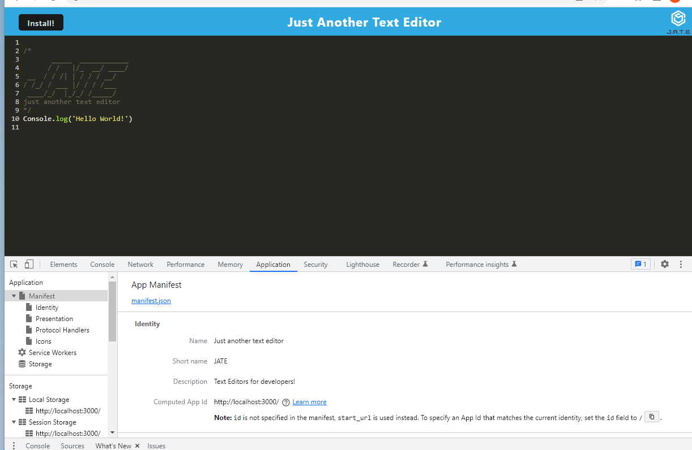
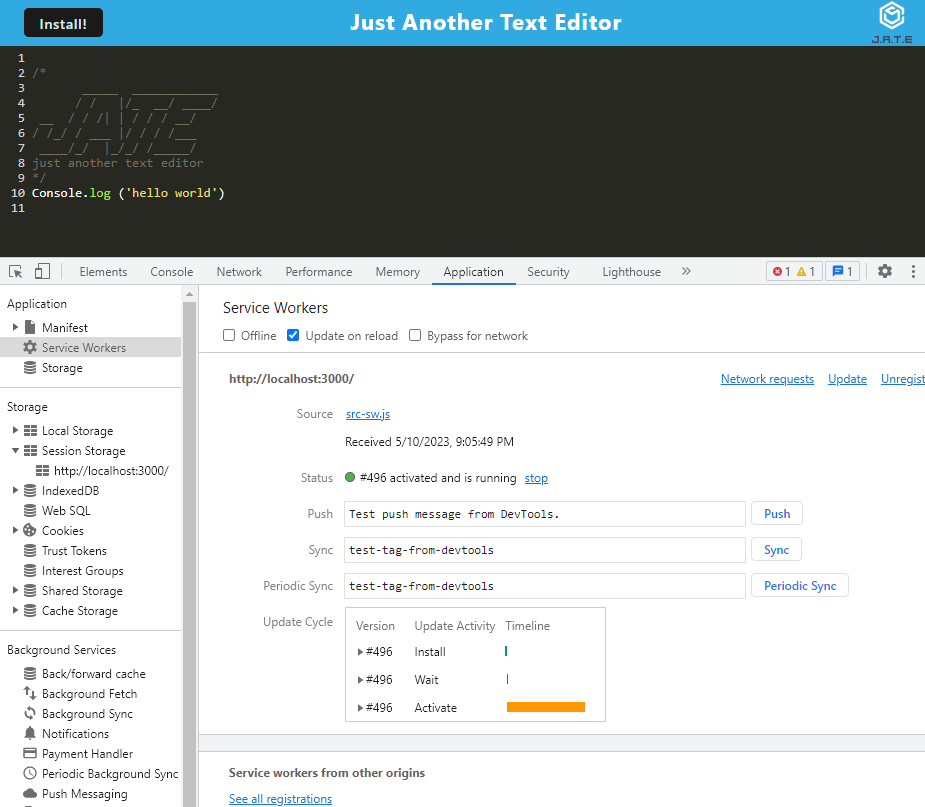
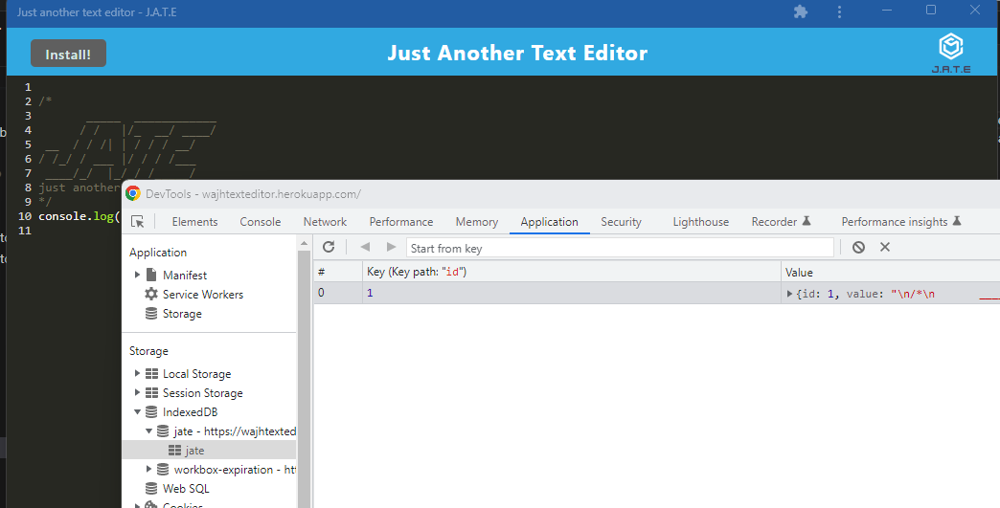

# Progressive-Web-App-TextEditor

## Table of Contents
  * [Descriptiom](#description)
  * [Instruction](#instruction)
  * [Usage](#usage)
  * [License](#license)
  * [Questions](#questions)
  
<a name="description"/>

## Description

This is a single page application that runs in the browser and meets PWA criteria. This features a number of data persistence techniques that serve as redundancy in case one of the options is not supported by the browser. The application will also function offline and you can download the app by simply click 'install' button. I use `idb`, which is a lightweight wrapper around the indexedDB API. 

Live deployed link: https://wajhtexteditor.herokuapp.com/








## Instruction


To start the app, run the command: ```npm run start```

<a name="usage"/>

## Usage

* Javascript
* Webpack: Service workers, manifest.json
* IndexedDb
* Node.js
* Express.js

<a name="license"/>

## License

MIT License

<a name="questions"/>

## Questions

* Github: https://www.github.com/WajhR

